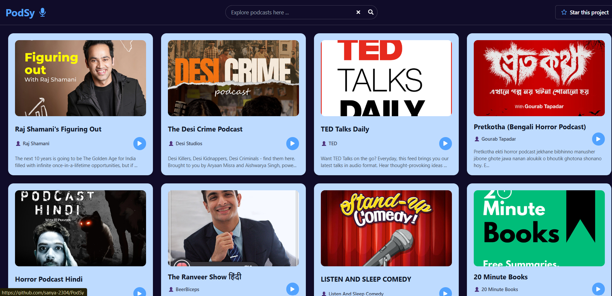

<<<<<<< HEAD
# 🎧 PodSy – Spotify Podcast Explorer
Access here: https://podsy.netlify.app/
Welcome to **PodSy**, a sleek React app that lets users explore and search podcasts using the [Spotify Web API](https://developer.spotify.com/documentation/web-api/). Whether you're a podcast lover or a developer learning APIs, this app is a quick and interactive way to browse trending shows on Spotify.



---

## 🚀 Features

- 🔍 **Search Podcasts** by title or keyword
- 🎙️ **View Publisher & Description** of each podcast
- 🖼️ **Responsive UI** built with TailwindCSS
- 🔗 **Play on Spotify** – direct links to each show's Spotify page
- ⚡ **Fast and Lightweight** – powered by Vite + React

---

## 🛠️ Built With

- [React](https://reactjs.org/)
- [Vite](https://vitejs.dev/)
- [Spotify Web API](https://developer.spotify.com/documentation/web-api/)
- [Tailwind CSS](https://tailwindcss.com/)
- [React Icons](https://react-icons.github.io/react-icons/)

---

## 🔐 Spotify API Setup

To use the Spotify Web API, you’ll need a **Client ID** and **Client Secret** from [Spotify Developer Dashboard](https://developer.spotify.com/dashboard/).

### 1. Create a `.env` file in the root directory:
```env
=======
###🎧 PodSy – Spotify Podcast Explorer
Welcome to PodSy, a sleek React app that lets users explore and search podcasts using the Spotify Web API. Whether you're a podcast lover or a developer learning APIs, this app is a quick and interactive way to browse trending shows on Spotify.


🚀 Features
🔍 Search Podcasts by title or keyword

🎙️ View Publisher & Description of each podcast

🖼️ Responsive UI built with TailwindCSS

🔗 Play on Spotify – direct links to each show's Spotify page

⚡ Fast and Lightweight – powered by Vite + React

🛠️ Built With
React

Vite

Spotify Web API

Tailwind CSS

React Icons

🔐 Spotify API Setup
To use the Spotify Web API, you’ll need a Client ID and Client Secret from Spotify Developer Dashboard.

1. Create a .env file in the root directory:
env
Copy
Edit
>>>>>>> ed250d459a877a21ebbf130c93ca1a83f5470294
VITE_CLIENT_ID=your_spotify_client_id
VITE_CLIENT_SECRET=your_spotify_client_secret
⚠️ Never commit your secret keys to version control.

<<<<<<< HEAD
## 💻 Installation
# Clone the repository
git clone https://github.com/sanya-2304/PodSy.git
cd PodSy
# Install dependencies
npm install
=======
💻 Installation
# Clone the repository
git clone https://github.com/sanya-2304/PodSy.git
cd PodSy

# Install dependencies
npm install

>>>>>>> ed250d459a877a21ebbf130c93ca1a83f5470294
# Start the development server
npm run dev
Then open your browser at: http://localhost:5173

<<<<<<< HEAD
##✨ Screenshots
<p align="center">  </p>


##⭐ Support
If you like this project, give it a ⭐ on GitHub!

##📄 License
This project is open source and available under the MIT License.

##👩‍💻 Author
=======
✨ Screenshots
<p align="center">  </p>
⭐ Support
If you like this project, give it a ⭐ on GitHub!

📄 License
This project is open source and available under the MIT License.

👩‍💻 Author
>>>>>>> ed250d459a877a21ebbf130c93ca1a83f5470294
Made with 💙 by @sanya-2304

